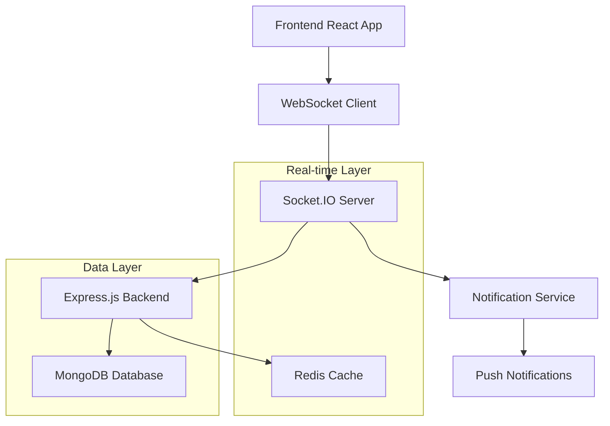

# Real-Time Chat System Design Document

## Overview

The real-time chat system will enable seamless communication between users and service providers through a modern, responsive chat interface. The system will use WebSocket connections for real-time messaging, integrate with the existing service modal, and provide a professional messaging experience similar to LinkedIn or WhatsApp.

## Architecture

### High-Level Architecture



### Technology Stack

- **Frontend**: React with Socket.IO client for real-time communication
- **Backend**: Node.js/Express.js with Socket.IO server
- **Database**: MongoDB for message storage and chat history
- **Cache**: Redis for session management and online status tracking
- **Real-time**: Socket.IO for WebSocket connections
- **Notifications**: Web Push API for browser notifications

## Components and Interfaces

### Frontend Components

#### 1. ChatButton Component
```jsx
// Location: frontend/src/components/ChatButton.jsx
// Purpose: Trigger button in service modal to open chat
// Props: providerId, providerName, isOnline, unreadCount
```

#### 2. ChatModal Component
```jsx
// Location: frontend/src/components/ChatModal.jsx
// Purpose: Main chat interface modal
// Props: isOpen, onClose, providerId, providerName
```

#### 3. MessageList Component
```jsx
// Location: frontend/src/components/MessageList.jsx
// Purpose: Display chat messages with scrolling
// Props: messages, currentUserId, isLoading
```

#### 4. MessageInput Component
```jsx
// Location: frontend/src/components/MessageInput.jsx
// Purpose: Input field for typing and sending messages
// Props: onSendMessage, onTyping, disabled
```

#### 5. OnlineStatus Component
```jsx
// Location: frontend/src/components/OnlineStatus.jsx
// Purpose: Display provider online/offline status
// Props: isOnline, lastSeen
```

#### 6. TypingIndicator Component
```jsx
// Location: frontend/src/components/TypingIndicator.jsx
// Purpose: Show when other party is typing
// Props: isTyping, userName
```

### Backend Components

#### 1. Chat Controller
```javascript
// Location: backend/controllers/chatController.js
// Purpose: Handle HTTP requests for chat operations
// Methods: getChatHistory, createConversation, uploadFile
```

#### 2. Socket Handler
```javascript
// Location: backend/sockets/chatSocket.js
// Purpose: Handle WebSocket events for real-time messaging
// Events: join_room, send_message, typing, disconnect
```

#### 3. Chat Service
```javascript
// Location: backend/services/chatService.js
// Purpose: Business logic for chat operations
// Methods: saveMessage, getConversation, updateOnlineStatus
```

#### 4. Notification Service
```javascript
// Location: backend/services/notificationService.js
// Purpose: Handle push notifications and email alerts
// Methods: sendPushNotification, sendEmailNotification
```

## Data Models

### Conversation Model
```javascript
{
  _id: ObjectId,
  participants: [
    {
      userId: ObjectId,
      role: String, // 'user' or 'provider'
      joinedAt: Date
    }
  ],
  serviceId: ObjectId, // Reference to the service being discussed
  lastMessage: {
    content: String,
    senderId: ObjectId,
    timestamp: Date
  },
  unreadCounts: {
    [userId]: Number // Unread count per participant
  },
  createdAt: Date,
  updatedAt: Date
}
```

### Message Model
```javascript
{
  _id: ObjectId,
  conversationId: ObjectId,
  senderId: ObjectId,
  content: String,
  messageType: String, // 'text', 'image', 'file'
  attachments: [
    {
      fileName: String,
      fileUrl: String,
      fileType: String,
      fileSize: Number
    }
  ],
  status: String, // 'sent', 'delivered', 'read'
  timestamp: Date,
  editedAt: Date,
  isDeleted: Boolean
}
```

### UserSession Model (Redis)
```javascript
{
  userId: String,
  socketId: String,
  isOnline: Boolean,
  lastSeen: Date,
  activeConversations: [String] // Array of conversation IDs
}
```

## Error Handling

### Connection Errors
- **WebSocket Disconnection**: Implement automatic reconnection with exponential backoff
- **Network Issues**: Queue messages locally and sync when connection is restored
- **Server Errors**: Display user-friendly error messages and retry mechanisms

### Message Delivery
- **Failed Send**: Show retry button and queue message for resend
- **Duplicate Messages**: Implement message deduplication using unique message IDs
- **Rate Limiting**: Prevent spam by limiting messages per minute per user

### File Upload Errors
- **File Size Limits**: 10MB for images, 25MB for documents
- **File Type Validation**: Only allow safe file types (images, PDFs, docs)
- **Virus Scanning**: Scan uploaded files for malware before storage

## Testing Strategy

### Unit Tests
- **Message Components**: Test message rendering, timestamps, status indicators
- **Chat Logic**: Test message sending, receiving, and status updates
- **File Upload**: Test file validation, upload progress, error handling

### Integration Tests
- **WebSocket Communication**: Test real-time message delivery
- **Database Operations**: Test message storage and retrieval
- **Authentication**: Test user authorization for chat access

### End-to-End Tests
- **Complete Chat Flow**: Test full conversation from start to finish
- **Multi-user Scenarios**: Test concurrent users in same conversation
- **Mobile Responsiveness**: Test chat interface on various screen sizes

### Performance Tests
- **Concurrent Connections**: Test system with 1000+ simultaneous connections
- **Message Throughput**: Test high-volume message sending
- **Database Performance**: Test query performance with large message history

## Security Considerations

### Authentication & Authorization
- **JWT Tokens**: Validate user tokens for WebSocket connections
- **Room Access**: Ensure users can only join conversations they're part of
- **Provider Verification**: Verify provider identity before allowing chat

### Data Protection
- **Message Encryption**: Encrypt messages in transit and at rest
- **PII Handling**: Sanitize and protect personally identifiable information
- **Data Retention**: Implement message retention policies and cleanup

### Content Moderation
- **Profanity Filter**: Automatically detect and flag inappropriate content
- **Spam Prevention**: Rate limiting and pattern detection for spam messages
- **Report System**: Allow users to report inappropriate conversations

## Performance Optimizations

### Real-time Performance
- **Connection Pooling**: Efficiently manage WebSocket connections
- **Message Batching**: Batch multiple messages for better performance
- **Compression**: Use WebSocket compression for large messages

### Database Optimization
- **Indexing**: Create indexes on conversationId, timestamp, and senderId
- **Pagination**: Implement cursor-based pagination for message history
- **Archiving**: Archive old conversations to improve query performance

### Caching Strategy
- **Redis Caching**: Cache active conversations and online status
- **Message Caching**: Cache recent messages for faster loading
- **CDN**: Use CDN for file attachments and images

## Deployment Considerations

### Scalability
- **Horizontal Scaling**: Design for multiple server instances
- **Load Balancing**: Distribute WebSocket connections across servers
- **Database Sharding**: Plan for database scaling as chat volume grows

### Monitoring
- **Connection Metrics**: Monitor active connections and connection health
- **Message Metrics**: Track message delivery rates and failures
- **Performance Monitoring**: Monitor response times and system resources

### Backup & Recovery
- **Message Backup**: Regular backups of chat history
- **Disaster Recovery**: Plan for system recovery and data restoration
- **Data Migration**: Strategy for migrating chat data if needed